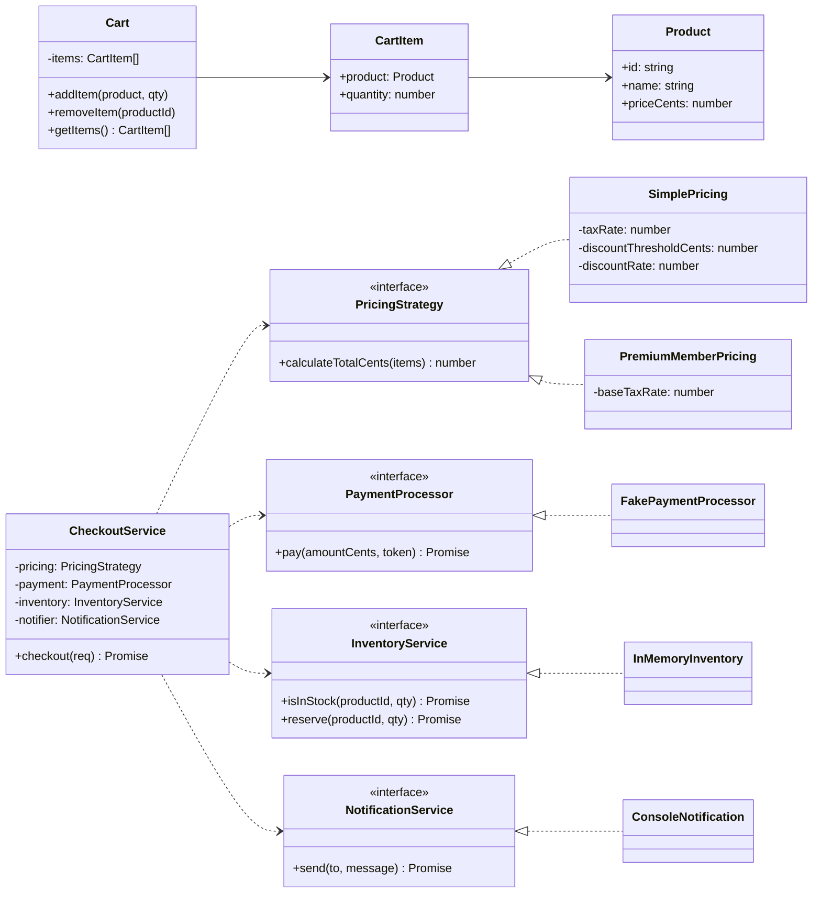

# E-commerce SOLID (TypeScript)

Aplicación mínima de e-commerce (checkout) diseñada para demostrar los principios SOLID.

## ¿Qué incluye?
- Dominio simple: carrito de compras, productos y checkout
- Interfaces (puertos) para pricing, pago, inventario y notificaciones
- Implementaciones alternativas intercambiables (OCP/LSP)
- Servicio de aplicación `CheckoutService` que depende de abstracciones (DIP)
- Diagrama de clases y mapeo de principios SOLID

## Diagrama de clases


## Principios SOLID aplicados
- SRP (Responsabilidad Única)
  - `Cart` gestiona sólo ítems del carrito.
  - `SimplePricing` y `PremiumMemberPricing` calculan precios.
  - `CheckoutService` orquesta el checkout.
- OCP (Abierto/Cerrado)
  - Nuevas estrategias de pricing o métodos de pago se agregan como nuevas clases sin modificar `CheckoutService`.
- LSP (Sustitución de Liskov)
  - `SimplePricing` y `PremiumMemberPricing` se pueden intercambiar donde se espera `PricingStrategy`.
- ISP (Segregación de Interfaces)
  - Interfaces finas: `PricingStrategy`, `PaymentProcessor`, `InventoryService`, `NotificationService`.
- DIP (Inversión de Dependencias)
  - `CheckoutService` depende de interfaces (abstracciones), no de implementaciones concretas.

## Cómo ejecutar
Requisitos: Node.js 18+.

1. Instalar dependencias
```bash
npm install
```
2. Ejecutar demo (ts-node)
```bash
npm start
```
3. O compilar y ejecutar desde `dist`
```bash
npm run build
npm run start:build
```

Deberías ver dos checkouts exitosos (uno con `SimplePricing` y otro con `PremiumMemberPricing`).

## Notas
- El inventario es en memoria y el pago es simulado para la demo.
- Cambia fácilmente las implementaciones por otras (por ejemplo, otro `PaymentProcessor`).
