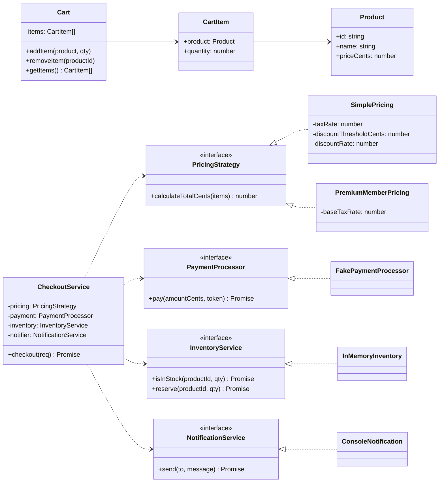

# E-commerce SOLID (TypeScript)

Aplicación mínima de e-commerce (checkout) diseñada para demostrar los principios SOLID.

## ¿Qué incluye?
- Dominio simple: carrito de compras, productos y checkout
- Interfaces (puertos) para pricing, pago, inventario y notificaciones
- Implementaciones alternativas intercambiables (OCP/LSP)
- Servicio de aplicación `CheckoutService` que depende de abstracciones (DIP)
- Diagrama de clases y mapeo de principios SOLID

## Diagrama de clases


## Principios SOLID aplicados
- SRP (Responsabilidad Única)
  - `Cart` gestiona sólo ítems del carrito.
  - `SimplePricing` y `PremiumMemberPricing` calculan precios.
  - `CheckoutService` orquesta el checkout.
- OCP (Abierto/Cerrado)
  - Nuevas estrategias de pricing o métodos de pago se agregan como nuevas clases sin modificar `CheckoutService`.
- LSP (Sustitución de Liskov)
  - `SimplePricing` y `PremiumMemberPricing` se pueden intercambiar donde se espera `PricingStrategy`.
- ISP (Segregación de Interfaces)
  - Interfaces finas: `PricingStrategy`, `PaymentProcessor`, `InventoryService`, `NotificationService`.
- DIP (Inversión de Dependencias)
  - `CheckoutService` depende de interfaces (abstracciones), no de implementaciones concretas.

## Cómo ejecutar
Requisitos: Node.js 18+.

1. Instalar dependencias
```bash
npm install
```
2. Ejecutar demo (ts-node)
```bash
npm start
```
3. O compilar y ejecutar desde `dist`
```bash
npm run build
npm run start:build
```

Deberías ver dos checkouts exitosos (uno con `SimplePricing` y otro con `PremiumMemberPricing`).

## Notas
- El inventario es en memoria y el pago es simulado para la demo.
- Cambia fácilmente las implementaciones por otras (por ejemplo, otro `PaymentProcessor`).

## Frontend (Vite + React)
Además del demo por consola, hay un frontend web simple conectado a la misma API.

Desarrollo (HMR):
```bash
npm run dev:full
```
Luego abre http://localhost:5173 (Vite) y la API queda en http://localhost:3000.

Producción (servido por el backend):
```bash
cd frontend
npm run build
cd ..
npm run dev
```
Luego abre http://localhost:3000. El backend sirve el build de `frontend/dist` con fallback SPA.

Opcional: si el proxy de Vite falla, puedes fijar la URL de la API en el cliente React:
```bash
echo "VITE_API_URL=http://localhost:3000/api" > frontend/.env.local
```

## Problema planteado
Construir un flujo de checkout de e-commerce que:
- Calcule el total con reglas de impuestos y descuentos.
- Verifique y reserve inventario.
- Procese pagos (simulado) y notifique al cliente.
- Permita cambiar políticas de pricing, proveedor de pagos o canal de notificación sin romper el resto del sistema.

La solución aplica SOLID para mantener el diseño extensible, testeable y de bajo acoplamiento.

## Principios SOLID 
- SRP (Responsabilidad Única): cada clase debe tener un único motivo para cambiar. Una sola responsabilidad clara.
- OCP (Abierto/Cerrado): el código debe permitir extenderse con nuevas funcionalidades sin modificarse (se agrega código, no se toca el existente).
- LSP (Sustitución de Liskov): si B hereda/implementa de A, debo poder usar B donde use A sin sorpresas ni romper contratos.
- ISP (Segregación de Interfaces): es mejor varias interfaces pequeñas y específicas que una grande y genérica.
- DIP (Inversión de Dependencias): los módulos de alto nivel dependen de abstracciones, no de implementaciones concretas.

## Fragmentos que cumplen SOLID

SRP — `Cart` sólo gestiona ítems del carrito
```ts
// src/domain/Cart.ts
export class Cart {
  private items: CartItem[] = [];
  addItem(product: Product, quantity: number = 1) { /* ... */ }
  removeItem(productId: string) { /* ... */ }
  getItems(): CartItem[] { /* ... */ }
}
```

OCP/LSP — Estrategias de pricing intercambiables
```ts
// src/application/ports.ts
export interface PricingStrategy { calculateTotalCents(items: CartItem[]): number }

// src/infrastructure/pricing/SimplePricing.ts
export class SimplePricing implements PricingStrategy { /* calcula total */ }

// src/infrastructure/pricing/PremiumMemberPricing.ts
export class PremiumMemberPricing implements PricingStrategy { /* alternativa */ }
```

ISP — Interfaces pequeñas y específicas
```ts
// src/application/ports.ts
export interface PaymentProcessor { pay(amountCents: number, token: string): Promise<PaymentResult> }
export interface InventoryService { isInStock(id: string, q: number): Promise<boolean>; reserve(id: string, q: number): Promise<void> }
export interface NotificationService { send(to: string, message: string): Promise<void> }
```

DIP — `CheckoutService` depende de abstracciones
```ts
// src/application/CheckoutService.ts
export class CheckoutService {
  constructor(
    private pricing: PricingStrategy,
    private payment: PaymentProcessor,
    private inventory: InventoryService,
    private notifier: NotificationService
  ) {}
  async checkout(req: CheckoutRequest): Promise<CheckoutResponse> { /* ... */ }
}
```
